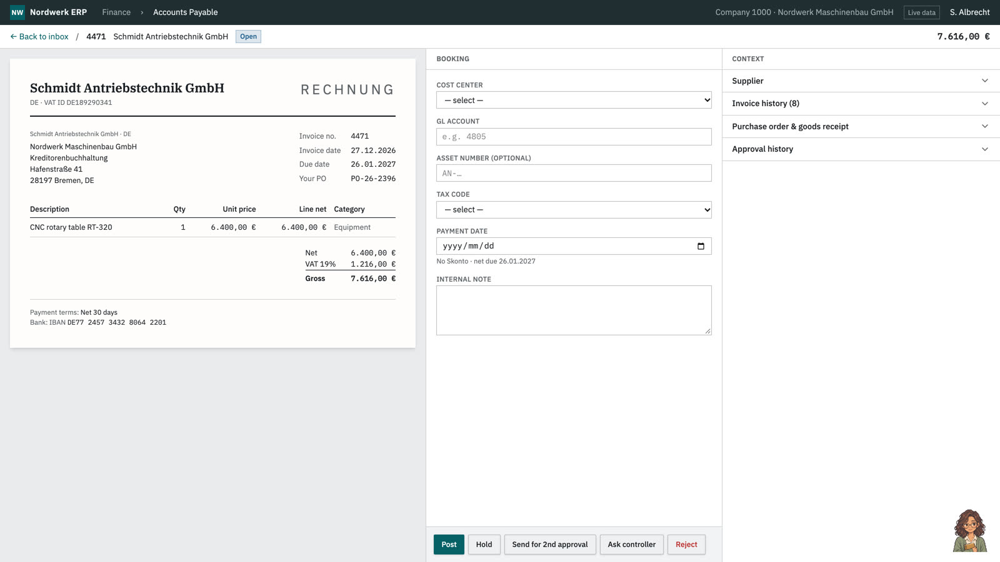

# Tacet

**An AI apprentice that learns what the AI doesn't already know.** Built for the HackNation × ElevenLabs "AI Apprentice" challenge.

Tacet watches an expert work and writes down its own prediction before every decision. When the expert does something it cannot explain, it waits for a natural pause and asks one question, spoken or typed, through its apprentice character, Mira. The answer is compiled into an executable Work Map of rules, thresholds and guardrails; the map is tested on cases the expert never showed, and then teaches a new hire in the expert's own words.

- Product: https://tacet.up.railway.app (console at `/app`)
- Film (English and German): [`site/assets/film.mp4`](site/assets/film.mp4), also at https://tacet.up.railway.app/assets/film.mp4

[](https://tacet.up.railway.app/assets/film.mp4)

Live pieces: product, landing and film at `tacet.up.railway.app`; console at `/app`; sealed test page at `/app/s/<sid>/proof`; Work Map MCP server at `/mcp`; ERP sandbox at https://erp-production-e3b0.up.railway.app (Invoices is the built-in accounts-payable workflow; `/support` is a Support desk Tacet learns from scratch).

## Try it in three minutes

Live sessions call real models and the voice agents, which need API keys; the hosted instance has them. Voice needs real Chrome with microphone access (embedded browser panes block it). Typing an answer works everywhere.

1. Open the ERP: https://erp-production-e3b0.up.railway.app. The Mira companion is loaded from the core. In her panel choose **Start session** (Live).
2. Book invoices: open one, set cost center, tax code and payment timing, save. Mira has committed a prediction for each field before you act. When you do something she cannot explain, she waits for a pause and asks one question about the invoice on screen. Answer with **Talk** (voice) or by typing, for example a threshold: "Equipment over 3,600 net is capex."
3. Open the console, https://tacet.up.railway.app/app, and pick the session. It shows the prediction, the competing hypotheses, the rule your answer compiled to, and a **learning receipt**: before and after prediction, your quote, the parameter diff and which later cases checked it.
4. Choose **Test it**. Tacet freezes a sealed boundary test: fresh cases around the learned threshold, predictions committed and SHA-256 hashed before any label. You label them in the console or the ERP. Misses correct the map and the next round uses new cases. **Restart from saved map** shows the map persists into a new session.
5. In the ERP companion choose **Debrief me**. Mira asks follow-ups about exceptions and unseen cases, then explains the process back for you to confirm or correct.
6. Choose **Teach Lena**. Book an invoice the expert never showed. When you reach for a wrong code the tutor blocks the save, quotes the expert and offers the replay. **Finish practice** shows the report card (mastered, practise next).

**New workflow, no pack:** open https://erp-production-e3b0.up.railway.app/support, choose **Learn this task** in Mira's panel, type a goal, show one to three tickets being routed, then **Done showing**. Mira asks about the first decision she cannot predict, compiles your answer into rules for this desk, and the same receipt, test, debrief and tutor loop applies. Verified live on the Support desk on 2026-10-03.

## How it maps to the brief

| Brief module | Where | Status |
|---|---|---|
| **Capture**: screen events into the agent, questions at pauses, at least one on a guardrail | `backend/shadow/static/capture.js` (observer, pause detection, companion, in-page voice), `planner.py` (value of information against interruption cost, pause gate), `engine.py`, `perception.py` (vision frames to events), `converse.py` (voice brain) | Live. The primary event source is DOM observation of the app; screen-share frames read by a vision model also become events through the console. |
| **Map**: debrief with 3+ new questions, teach-back, clickable Work Map linked to moments and quotes | `engine.py` debrief (coverage, conflict and exploration probes, frozen self-exam, teach-back), `workmap.py`, `compiler.py`, console `/app/s/<sid>/map` | Live. Rules and guardrails carry the expert's quote and provenance; the screen moment is a replay of captured frames. |
| **Teach**: tutor, new hire on an unseen case, wrong decision caught before save | `engine.py` tutor mode, `coach.py`, `novice.py`, `/api/capture/before_save`, `window.shadow.beforeSave`, `GET /api/sessions/{sid}/tutor/report` | Live in the ERP, where every save awaits the hook. On arbitrary websites the extension observes but cannot yet block a save. |

The five Apprentice Tests:

| Test | Our answer | Where |
|---|---|---|
| 1. When to ask | An activity monitor tracks typing, focus and idle time. A pause gate releases a question only after a natural pause, and each question must beat an interruption cost. The ElevenLabs agents use patient turns, and filler turns return `skip_turn` so the agent stays silent. | `planner.py`, `activity.py`, `converse.py` |
| 2. What to ask | Ask only when a prediction failed and the Work Map cannot already explain it. Candidate questions are ranked by expected value of information (Bayesian threshold posteriors, BALD probes); a bandit picks the question type. | `bayes.py`, `planner.py`, `hypotheses.py`, `questions.py` |
| 3. When it has understood | The debrief ends when coverage, conflict and exploration probes are closed, a frozen self-exam passes on held-out cases, and the expert confirms the teach-back. | `engine.py` |
| 4. Whether the new hire learned | Per-rule mastery tracking (BKT), blocked wrong saves with the expert's words, a report card, new cases near the boundaries. Separately, the sealed test checks the map itself on cases nobody showed. | `engine.py`, `coach.py`, `proof.py` |
| 5. Trust | An "Off the record" button: nothing said or done is stored. Answers are scrubbed (IBAN, email, phone, card, tax id) before storage or any model call. Replay frames stay in the browser unless vision reading is switched on. | `redact.py`, `/api/data/inventory`, `site/privacy.html` |

Stretch goals:

- **Vision frames to events:** `perception.py` turns two consecutive frame readings into `case_opened`, `field_changed` and action events with redacted values. Unit-tested on fixed readings; the live frame path runs from the console.
- **Tutor report card:** end-of-practice summary of mastered rules and what to practise next.
- **Work Map MCP server:** `/mcp` exposes `list_steps`, `list_guardrails`, `check_decision` and `explain_rule`. `setup_elevenlabs.py --mcp` registers it with ElevenLabs and attaches it to both agents. The map also exports as JSON, Markdown and an agent skill.
- **Two experts, one task:** `compare.py` runs two maps over a shared pool plus boundary cases and returns each conflict with a question for each expert. Tested offline on hand-built maps; not shown with two live experts.
- **German expert, English tutor:** the compiler keeps the German quote verbatim with an English translation, and the tutor speaks English. Covered by `tests/test_language.py`; two known leaks are still marked `xfail`.
- **Chrome extension:** `extension/` turns Mira on for any site you opt in, with "Learn this task". Loads unpacked; Web Store listing prepared, not submitted.
- **German film:** the film has English and German narration (each voiced in Eleven v4), switchable on the landing page.

Simulated versus live. Rehearsal mode and `sim.py` use a scripted expert for tests and the console's Practice run; they are labelled everywhere and the proof endpoints refuse them. The curves in `backend/eval_out/` are also against that scripted expert (oracle-informed stand-ins for the model, no LLM parsing): whole-decision agreement on 60 held-out invoices was 38% from the process document alone, 73% for "always ask why", and 98% for Tacet; with 40% of answers corrupted, 70% against 60%. That compares strategies; it is not a human result. The live evidence is separate: from a real compile of a typed answer (taught 3,600, evaluator labelled at 4,000), round 1 scored 9/11 with both misses in the 3,600 to 4,000 band, the threshold moved to 4,069, and after a restart from the saved map it scored 11/11.

## Architecture

```
 expert's app (ERP / any site)            Tacet Core (FastAPI)                       ElevenLabs
 ┌───────────────────────────┐   events   ┌──────────────────────────────────────┐   ┌─────────────────────┐
 │ capture.js: observer +    │ ─────────► │ predict → gap → hypotheses           │   │ Agent: interviewer  │
 │ Mira companion (+ voice)  │ ◄───────── │ → EVOI vs interruption cost          │   │ Agent: tutor        │
 │ beforeSave hook           │ questions, │ → ask at a pause → compile answer    │◄──┤ Eleven v4 Turbo     │
 └───────────────────────────┘ verdicts   │ → rules + thresholds (Bayes belief)  │   │ Custom LLM ─────────┼─► /v1/chat/completions
                                          │ → receipts → sealed proofs           │   │ MCP tools ──────────┼─► /mcp (Work Map)
 console (React): predictions,            │ → debrief → teach-back → tutor       │   └─────────────────────┘
 Work Map, receipts, /proof               └───────┬──────────────────┬───────────┘
                                                  │                  │
                                         Postgres / SQLite     Claude + GPT-6 Luna (translate only)
```

The engine is plain Python and numpy. Language models only translate: speech or typing into a structured rule, and rules into a sentence. A rule counts because its behavior holds on cases, not because the model said so. Tiers: Claude Sonnet 5.5 for compile and reasoning, Claude Haiku 4.5 for fast and spoken turns, GPT-6 Luna for vision (Claude Haiku 4.5 as fallback), with failover between providers and a spend meter on `/health`.

ElevenLabs. Two Conversational AI agents, interviewer and tutor, run on Eleven v4 Turbo with patient turn-taking. Each uses a Custom LLM pointing at our `/v1/chat/completions`, so Tacet decides what is said and when; control tags (`[[shadow:ask|debrief|intervene|say ...]]`) become speech, and idle turns return `skip_turn`. The Work Map MCP server is attached to both. The film narration is ElevenLabs text to speech (v4), the music bed is ElevenLabs Music, and the German narration is voiced directly in Eleven v4 from a hand translation (the ElevenLabs Dubbing pipeline is kept in `design/video/dub.mjs`).

## Repo layout

```
/                  Nordwerk ERP sandbox (Lovable project, TanStack Start), see below
backend/           Tacet Core: shadow/engine.py, workmap.py, bayes.py, planner.py, proof.py, receipts.py,
                   compiler.py, converse.py, perception.py, mcp_server.py, compare.py, redact.py, packs/
console/           Tacet console (React + Vite + ElevenLabs React SDK), served at /app
extension/         Chrome MV3 extension (Mira on any site)
site/              landing page, privacy page, film assets
deploy/            Railway Dockerfile and notes
design/            design system, film source, task reports
advisory/          independent reviews (advice, not spec)
SHADOW_ARCHITECTURE.md   design and reasoning
```

**The ERP sandbox lives at the repo root.** `src/`, `public/` and the root `package.json` are the Nordwerk ERP, a Lovable project synced to this repository. It is the app Tacet observes; the observer contract is `src/lib/erp/shadow.ts` (`data-shadow-*` attributes, `window.shadowERP`, `beforeSave`). Routes: `/` (Invoices) and `/support`. Lovable mirrors `main`, so pushed history is never rewritten.

## Run locally

```bash
cd backend && python3 -m venv .venv && .venv/bin/pip install -r requirements.txt
cp .env.example .env            # add ANTHROPIC_API_KEY, OPENAI_API_KEY, ELEVENLABS_API_KEY (never committed)
.venv/bin/uvicorn shadow.main:app --port 8000     # no --reload: reloads wipe in-memory sessions
cd ../console && npm install && npm run dev       # console on :5173
cd .. && npx bun install && npm run dev -- --port 8080   # ERP at the repo root
```

For voice, expose the core (ngrok or a Cloudflare tunnel) and run `cd backend && .venv/bin/python scripts/setup_elevenlabs.py --public-url <url> --mcp`; see [ELEVENLABS_SETUP.md](ELEVENLABS_SETUP.md). Agent ids are kept in `backend/.elevenlabs_agents.json` (gitignored). Without keys the console falls back to the labelled Practice run.

Tests: `cd backend && .venv/bin/pytest -q` gives 269 passed, 2 xfailed, 2 xpassed (run on 2026-10-03, about 5 seconds, offline). The xfail and xpass cases are the documented language leaks.

Deploy: Railway, region us-west2, three pieces: `core` (backend, console and landing, from `deploy/core.Dockerfile`), `erp`, and Postgres. Keys are Railway variables. See [deploy/README.md](deploy/README.md). Sessions are in memory, so a redeploy ends live sessions; Work Maps, the decision ledger and receipts persist in Postgres.

## Privacy

Captured: field values and clicks in the observed app; decisions, with the prediction written beforehand; the expert's questions and answers; Work Map versions, receipts, sealed tests and trainee attempts. Not captured: keystroke contents, anything done while off the record, other applications, passwords, hidden inputs, and card or IBAN-looking values (the generic observer skips them).

Redaction: answers are scrubbed in `backend/shadow/redact.py` before storage or any model call (IBAN with mod-97 check, email, phone, Luhn-checked cards, tax ids, URLs carrying secrets). Personal names are deliberately not redacted, and Presidio is not used. Replay frames stay in the browser for a few minutes and are sent to a vision model only if vision reading is on, with known sensitive fields masked.

Storage: the core's database (Postgres on Railway, SQLite locally). Voice audio and transcripts go to ElevenLabs under its retention settings; case facts and scrubbed answers go to the Anthropic and OpenAI APIs. There is no self-service delete endpoint yet. Details: [site/privacy.html](site/privacy.html) and `/api/data/inventory`.

## Limitations and what's next

- The accounts-payable workflow has the deepest evidence and a curated pack of priors. Other forms use a pack built at run time from your demonstrations, verified on one structured form (the Support desk). It is not proven on arbitrary websites.
- Tutor blocking works where the host awaits `beforeSave` (the ERP). The extension cannot stop a save on a site that does not.
- Rules that reference facts not on screen compile but never fire. Tacet should ask "where do you look that up?" and does not yet.
- Sessions live in memory, so a restart ends them while saved maps persist. Receipts are shown per session; `/api/history` lists them across sessions.
- Two-expert comparison and the German path are tested offline, not demonstrated with live experts. Extension voice needs a live microphone smoke test.
- Evaluation numbers come from a scripted expert.

Moonshot: certify an agent the way we certify a person. Give an agent the Work Map through `/mcp`, have it take the same sealed boundary test, and grant permission rule by rule, only for the rules it passes, while people keep the judgment calls. The pieces exist today: the Work Map export, the sealed test with committed predictions, and the MCP tools. Running an agent through the test and enforcing the per-rule permission is the part still to build.

## Credits

Solo build by Shubham Joshi. Design system: [design/DESIGN.md](design/DESIGN.md). The demo expert's hidden rules: [SABINE_ROLE_CARD.md](SABINE_ROLE_CARD.md).
