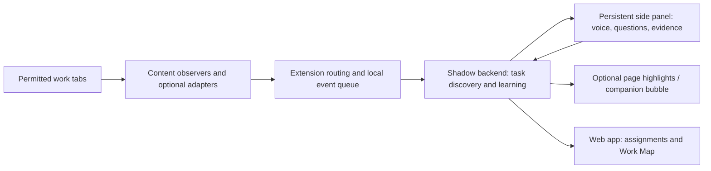

# Browser companion proposal

Proposal only. No extension or native application was built or installed in this investigation.

## Decision

Start with a **Chrome extension containing a persistent side panel and page observers**, backed by the existing Shadow service. Keep the ERP as a controlled demo/test fixture. Add native support later only if following desktop applications becomes a requirement.

A persistent companion and reliable understanding of every application are separate engineering problems. Packaging the existing bubble into an extension solves distribution/presence; it does not solve task discovery or observation semantics.

## What each delivery option can do

| Option | Companion follows navigation | Reads work context | Desktop applications | Fit |
|---|---|---|---|---|
| Current injected ERP script | Within the integrated ERP | Excellent structured invoice context from custom hooks | No | Current demo |
| Ordinary web app + user screen share | App UI stays in its own page/window | Pixels of the user-selected source; no general DOM access to unrelated sites | Can receive selected window/screen pixels | Useful fallback, requires explicit capture |
| Browser extension | Side panel can persist across tabs; overlays can be reinjected on permitted pages | DOM labels/actions plus optional screenshots on permitted sites | No general native app semantics or OS-wide companion | Recommended browser product |
| Native helper/app | Can provide a desktop companion | OS capture/accessibility subject to platform permissions | Yes, with platform-specific implementation | Later desktop expansion |

Chrome's Side Panel API explicitly supports persistence when navigating between tabs and a global panel for a window. This supports the desired “stay beside me” experience without a native app. [Official API](https://developer.chrome.com/docs/extensions/reference/api/sidePanel)

Content scripts can read/modify page DOM and message their parent extension. They run in an isolated world by default. Shadow's current use of `window.shadowERP` therefore needs an explicit bridge or an adapter; copying the script into an isolated content script is insufficient. [Content scripts](https://developer.chrome.com/docs/extensions/develop/concepts/content-scripts)

## Proposed experience

1. User opens Shadow from the browser toolbar and chooses a workflow or **Learn a new task**.
2. The panel identifies the current task, expert/learner mode, and whether this site is being observed.
3. For a new task, Shadow asks for the intended outcome and requests one demonstration.
4. The user works across permitted tabs. A small optional bubble signals a pending question; detailed answers, voice, and knowledge remain in the side panel.
5. Site/tab changes preserve the session. Shadow asks whether a new context belongs to the task when it cannot tell; it does not silently mix unrelated work.
6. The user can pause, exclude a page, answer later, or open the full Work Map.

The panel should name its state accurately: **Observing**, **Waiting for an answer**, **Learning**, **Needs context**, or **Paused**. Seeing a page does not mean it has understood the task.

## Proposed components and ownership

- **Page observer:** visible labels, values, clicks, changes, navigation, relevant DOM regions; stable event IDs and timestamps. Capture only task-relevant data. Identify programmatic changes separately where possible; seeing a DOM mutation does not prove user intent.
- **Site adapter:** optional high-fidelity semantic mapping for known apps, including the existing ERP. An adapter describes observability and operations; it must not contain hidden expert policy used to claim learning.
- **Routing/queue:** explicit workspace ID, workflow ID, session ID, actor ID, tab/document/frame identity, event sequence, source type, deduplication, reconnect.
- **Side panel:** current session, voice/text, interruption controls, concise learning receipt. Put microphone-dependent UI in the panel initially and test reconnection rather than assuming voice survives every panel/window lifecycle.
- **Backend:** normalize observations, detect episodes/decisions, propose new schemas, run learning, store evidence and map versions. Do not make a background service worker the authoritative learning store.

Chrome can terminate an extension service worker after inactivity. Persist routing/queue state and restore it on wake; do not assume long-lived globals. Test worker suspension and browser restart. [Lifecycle documentation](https://developer.chrome.com/docs/extensions/develop/concepts/service-workers/lifecycle)

## Access and capture boundaries

`activeTab` is temporary access granted through a user action; cross-origin navigation revokes it. A panel remaining visible does not grant it access to every new site. For a companion following work across sites, request optional host access for the sites the user enables. [activeTab](https://developer.chrome.com/docs/extensions/develop/concepts/activeTab)

Screen share and tab capture are separate from DOM permission. `getDisplayMedia()` prompts the user to select a source, requires user activation, and does not persist permission for a later request. It can provide selected desktop pixels without a native application, but it does not provide desktop accessibility semantics. A single selected tab stream is not a promise to capture whichever tab later becomes active. [Screen Capture API](https://developer.mozilla.org/en-US/docs/Web/API/MediaDevices/getDisplayMedia) · [Chrome tab capture](https://developer.chrome.com/docs/extensions/reference/api/tabCapture)

Do not promise universal observation: browser-internal pages, frame permissions, canvas-heavy apps, closed components, and ambiguous controls require explicit support testing or fallbacks. Missing information should produce “I cannot see that field” and a targeted question, not a fabricated value.

The current observer's PII rectangles come from ERP-specific attributes. Those are not a general redaction system for arbitrary sites. Exclude password/secret inputs and add explicit site/session controls before broad capture. Avoid transmitting all browsing content to the server by default.

## Concrete changes needed from today's companion

1. Replace global-latest session following with explicit session binding. Opening a second expert's session must not redirect the first observer.
2. Split ERP-specific selectors and `shadowERP` access from the UI/transport. Keep the existing adapter for the demo.
3. Bundle extension code, including its voice SDK. Today's `capture.js` dynamically imports the ElevenLabs client from a CDN; that pattern needs changing for a normally distributed Manifest V3 extension. Chrome requires extension executable code to be packaged locally. Backend responses may remain data. [Remote hosted code guidance](https://developer.chrome.com/docs/extensions/develop/migrate/remote-hosted-code)
4. Add generic observation events with capability reporting: DOM available, pixels available, save hook available, or unsupported.
5. Introduce a stable authenticated backend endpoint and scoped session transport before multi-company use. Never place model provider credentials in page or extension code.
6. Handle SPA navigation, full reloads, new tabs, reconnects, duplicate events, and task boundaries.
7. Surface coaching versus enforcement explicitly. The generic observer can suggest/flag; reliable blocking needs an application integration or known action contract. The present ERP save hook is stronger than what an arbitrary site offers.

These are design requirements for the proposed product, not a request for additional authorization during this audit.

## Minimum acceptance demonstration

- Open a task on one supported site; navigate within it and to a second enabled origin. Panel and session persist.
- Show that each captured event is bound to the correct tab and task, including two simultaneous user sessions.
- On an unapproved origin, panel remains usable but explicitly says observation is unavailable.
- Reload the page and suspend/restart the worker; queued events deduplicate and reconnect.
- Answer via text and voice without returning to the main dashboard. Verify actual microphone/connect/disconnect behavior.
- Add one supported, expert-taught rule; make a fresh prediction that cites that rule.
- Pause capture and verify no new task observations are sent.
- Show an unsupported UI example and the system's truthful fallback.

Completing this demonstrates a browser companion. To claim novel-task learning, also pass the separate cold-start evaluation in [the learning proposal](NOVEL_TASK_LEARNING_PROPOSAL.md).

## When native becomes necessary

For an OS-wide floating companion with reliable native-app context/actions, plan a native helper with platform capture/accessibility integration. The extension can communicate with a separately installed native host through Chrome Native Messaging; an extension alone does not install or replace that host. [Native messaging](https://developer.chrome.com/docs/extensions/develop/concepts/native-messaging)

Defer this until a target workflow actually spans desktop apps. Browser-first preserves the central learning problem without adding two desktop platforms to the hackathon scope.
