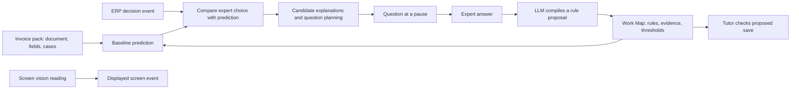
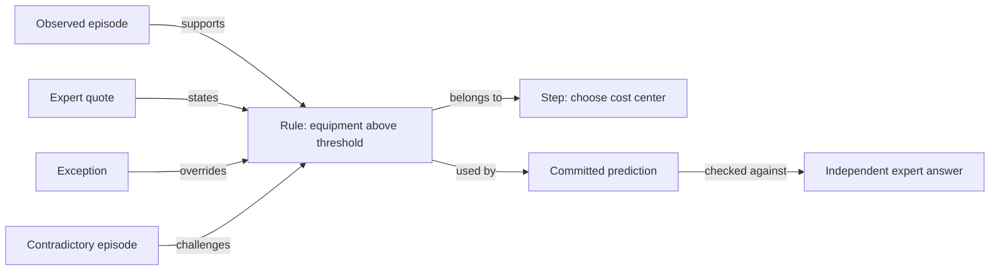

# Product and engine audit

Snapshot and method: see [README](README.md). “Implemented” below means source exists; tests and live observation are identified separately. A feature's presence in source is not proof of reliable end-to-end behavior.

## 1. What the user actually has

| Surface | Source / route | Present behavior | Qualification |
|---|---|---|---|
| Nordwerk ERP | root `src/`, inbox `/`, invoice `/invoice/:id`, port 8080 | Invoice workbench, context panels, booking and route actions | Demo workplace; structured invoice cases and explicit observation hooks |
| Shadow home | `console/src/pages/Home.tsx`, `/`, port 5173 | Capture/tutor launch, live/rehearsal selection, language, provider checks, session list | Technical demo setup; no company onboarding or assignment dashboard |
| Shadow session console | `console/src/pages/Console.tsx`, `/s/:sid` | Screen share, optional vision, voice/text, questions, predictions, hypotheses, learning map, debrief, tutor progress | Capture/debrief/tutor are modes of the same screen, not three independent apps |
| Work Map | `console/src/pages/MapPage.tsx`, `/s/:sid/map` | Step cards, selectable rules/guardrails, quotations, evidence, SOP/skill/JSON downloads | Heading explicitly says supplier invoice; no general graph canvas |
| Ambient companion | `backend/shadow/static/capture.js`, injected by `src/lib/erp/shadow.ts` | Floating companion, learned/confirmed counters, question bubble, voice, typed answer, off-record, tutor transition, notebook link | Real embedded UI, not a standalone extension; depends on ERP contracts |

The user did see multiple interfaces. Counting deployment units gives **two frontend apps plus an injected companion**. Counting screens gives home, session console, map, ERP inbox, and invoice workbench. The console package still has the name `web`, which can add naming confusion. Current tracked Git history adds `console/package.json` alongside the ERP in commit `d3b84e0`; this audit does not establish every discarded prototype Opus may have shown earlier.

Recent commits moved voice into the companion and added typed answers. Claims that voice is available only in the console are stale. The actual ERP tab visibly showed the companion and a question during this audit. No clicks, answers, or session changes were made.

The notebook link targeted port 5173, but that port was not serving at the spot check. This is an immediate accessibility gap for the map/console experience, not evidence that those screens were never built.

## 2. Capability inventory

| Capability | Current status | Evidence / remaining gap |
|---|---|---|
| Work an invoice in the sandbox | Implemented; runtime page observed | Root ERP with case data, controls, explicit save hook |
| Companion inside that sandbox | Implemented; runtime observed | `capture.js`; now includes voice/text controls |
| Predict before expert decision | Implemented; synthetic integration exercised | `engine._commit_prediction`, `on_decision`; no broad live benchmark |
| Extract a rule from spoken/typed explanation | Real LLM path implemented; quality unverified here | `compiler.compile_answer` calls structured LLM parsing; rehearsal replaces it |
| Execute learned rules | Implemented and independently exercised | Custom manually supplied 7,300 threshold changed predictions at 7,301, not at 7,300 |
| Track evidence and contest rules | Implemented; unit tests passed | WorkMap belief state and evidence replay; confidence is heuristic |
| Ask selectively / wait for pauses | Implemented; synthetic integration exercised | Planner budget, question value, fatigue, activity tracker |
| Debrief, self-exam, teach-back | Implemented; synthetic integration exercised | Frozen predictions and fresh exam rounds; short tests on pack-generated cases |
| Coach a trainee before saving | Implemented in ERP; synthetic test passed | Requires cooperative `beforeSave`; integration fails open on errors |
| Explain rules visually | Implemented in console source | Work Map, quotes, evidence, hypothesis bars, threshold curve |
| Export knowledge | Implemented | Markdown, JSON, agent skill; export is not proof of successful deployment elsewhere |
| Reuse knowledge across sessions | Partial | Maps persist by expert/pack, but fresh capture is the default; no clear “continue learning” product flow |
| Learn multiple named experts | Backend foundation only | Expert is a string; UI defaults to Sabine, trainee to Lena; no conflict reconciliation |
| Company assignments and roles | Not implemented in examined flow | No org/workflow membership, assignment, publication approval, or scoped learner lifecycle |
| Follow arbitrary browser sites | Not packaged | No extension manifest; ERP-specific DOM attributes/state API |
| Discover a novel task | Missing | Preloaded case lookup; no observation-to-task-model admission |
| Learn a new feature absent from current schema | Missing reliable path | Unknown DSL names can be accepted syntactically and evaluate false |
| General branching knowledge graph | Missing as a user view | Existing model has steps, rule references and exception parents; no general typed graph view |

The demo and engine are materially built. The general-task product and organization layer remain substantial work. A percentage would imply a scope and weighting that have not been agreed.

## 3. How the engine actually works

The final vision branch is intentional: at this snapshot, `on_event('vision')` emits a screen event; it does not construct a new case or initiate the prediction/learning loop. The generic perception schema is a useful component, but its output is not wired into task discovery.

The novice first executes known rules; the LLM fills uncovered fields and provides a rationale. The seed document rules already cover many invoice outputs, so much baseline behavior is deterministic. This is valid engineering, but “the model independently figured out the whole task” would be inaccurate.

An expert's answer is converted into conditions and outputs, given a quote/evidence link, then replayed against recorded episodes. Thresholds maintain distributions. New predictions and tutoring checks use the changed map. This is explicit memory/rule learning; model weights do not change.

The pack abstraction is not fully domain-independent in practice. Beyond the only registered invoice pack, core engine functions contain `inv.`-specific exploration, threshold restoration, and excluded invoice feature names. Replacing the pack alone would not complete generalization.

## 4. What is real, simulated, or unproven

**Real implementation:** structured LLM calls in live mode; executable rule evaluation; evidence records; hypothesis scoring; threshold posteriors; question scheduling; exports; ERP observer and save interception; frontend displays derived from backend session state.

**Explicit simulation:** `simulate=true` installs `fake_propose` and `FakeCompiler`. Those test doubles use known oracle rules and can supply a correct rule without interpreting a meaningful natural-language answer. `sim_answer` and `OracleSabine` provide expected responses. This is appropriate for testing orchestration, not evidence that speech interpretation works.

**Prepared demo scaffolding:** the invoice entities, allowed output values, written procedure, demo cases, variation generator, and likely exception families are developer-authored. Live mode does not erase that prior context.

**Not established here:** repeatable full live capture-to-tutor performance, arbitrary screen-only learning, new-task discovery, robust cross-site observation, or company-wide knowledge transfer. No provider calls or voice session were initiated by this audit. One in-progress runtime session had one episode and zero learned rules when observed; it had not demonstrated a complete learning outcome at that point. That alone proves neither success nor failure.

### Existing evaluation, honestly interpreted

The stored synthetic harness reports whole-decision agreement on 60 generated invoice cases:

| Explanation corruption setting | Shadow | Ask-always-why approximation | Questions, Shadow / comparator |
|---|---:|---:|---:|
| 0.0 | 59/60 (98.3%) | 44/60 (73.3%) | 27 / 6 |
| 0.2 | 59/60 (98.3%) | 44/60 (73.3%) | 39 / 6 |
| 0.4 | 42/60 (70.0%) | 36/60 (60.0%) | 42 / 6 |

Document-only baseline: 23/60 (38.3%). Source: `backend/eval_out/results.json` and `backend/scripts/eval_curves.py`.

These numbers test a synthetic setup with oracle-informed proposals/compiler, one noise seed, unequal question budgets, correct counterfactual answers, and unconditional simulated confirmation/teach-back. The file discloses these limitations. They do **not** establish 98% real-world accuracy, fewer total questions, or general resistance to misleading experts. Preserve those qualifications wherever curves are displayed. Questions include debrief/exam work, not only live interruptions.

### Independent diagnostics performed here

See `verification.json` and its reproducible script.

1. Unknown support-ticket case: ignored; seven preloaded cases remain, zero predictions.
2. Vision event describing that unfamiliar task: only `screen_event` emitted; no case, prediction, or map change.
3. Manually insert a previously unused 7,300 rule: runtime correctly selects the document result at 7,299/7,300 and the inserted rule at 7,301/9,000. This establishes flexible rule execution, **not automatic learning**.
4. Condition on absent `inv.customer_risk_tier`: passes syntax validation and evaluates false. The compiler's syntax check is not semantic validation against the available observation schema.
5. Existing backend suite: 16 passing tests; its main capture/debrief/tutor test uses simulated components.

## 5. Product issues that matter to the claim

- **Fresh capture resets knowledge by default.** Persistence exists, but the main capture start supplies no continuation choice. Users expecting gradual learning across days can restart from the document unknowingly.
- **Global latest-session fallback is a demo convenience.** `_session(None)` and unpinned capture follow the latest session. Multi-user browser work requires explicit workspace/workflow/session binding.
- **Knowledge validity is narrower than the word “confirmed” suggests.** One qualifying independent agreement plus testimony can reach the implementation's confirmation threshold. `belief.p` is a weighted score, not a calibrated probability of real-world correctness. A hypothetical answer is not equivalent to a completed real task.
- **Observation of attention is a proxy.** The UI's “looked” indicator comes from field/panel interaction cues, not eye tracking or proof of which fact caused the expert's choice.
- **Missing semantics may look like a nonmatching rule.** Add schema-aware validation and distinguish missing, unreadable, false, and unknown before supporting novel tasks.
- **Screen evidence is not yet a durable replay archive.** The screen hook stores sampled frames in browser memory; the map page shows timestamps/evidence but does not itself retrieve durable recordings. A timestamp should not imply a surviving playable recording.
- **Simulated actions can be injected through the simulation endpoint.** The inspected `/sim/step` handler lacks an explicit simulated-session guard even though the console hides rehearsal controls for live sessions. Separate event provenance and reject simulation on live sessions before presenting a strong proof ledger.
- **Advice and enforcement differ.** ERP `beforeSave` deliberately allows on integration failure. General websites lack this cooperative save contract. Present the current tutor as guidance, not universal transaction enforcement.
- **Exports include stated knowledge.** `TRUSTED` includes stated and confirmed. Export copy saying “captured and verified” can overstate the status of untested testimony. Preserve status on every exported rule.

## 6. Learning visualization: what exists and what to add

Existing `WorkMapView.tsx` renders ordered steps and their rules/guardrails, confidence badges, expert quotes, conditions, and supporting/contradicting evidence counts. `MapPage.tsx` provides a selectable evidence inspector. `Hypotheses.tsx` shows competing explanation weights; `Threshold.tsx` shows a distribution; the session feed shows events. These are useful views of actual application state.

Recommended product labels: **What Shadow knows**, **Why this suggestion**, and **What remains uncertain**. Avoid “watch the model think”: these views cannot expose or verify internal neural reasoning.

Add a typed graph only where it makes relationships clearer:

This is a **proposed** graph, not a screenshot of today's UI. It should render stored IDs and typed links, with version comparison and filters for workflow/expert/status. Clicking any edge should reveal its evidence. Unknown or unsupported relations must stay absent. A user-facing runtime trace can highlight observed facts → fired rules → selected result → later outcome; natural-language rationale should be labeled a generated explanation, not used as proof of rule execution.

First make the existing map reachable and supply an honest learning receipt: pre-answer prediction, exact teaching evidence, map change, independent result, and limitations. A larger graph is secondary to that proof.
